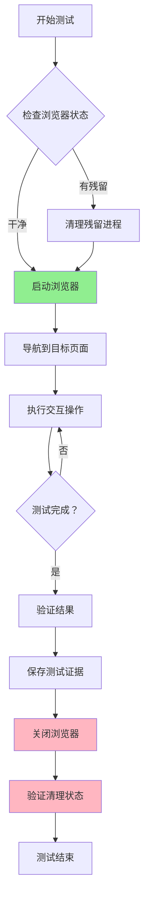

# Playwright MCP 流程指导

## 用途

**核心目的**：规范 Playwright MCP 执行流程，确保浏览器生命周期管理正确，避免进程混乱。

**适用场景**：
- 执行浏览器 E2E 测试
- 复现和验证 Bug
- 探索式页面测试
- 回归测试执行

**不适用场景**：
- 生成测试代码（使用 `bmad-qa-generate-e2e-tests`）
- 代码审查（使用 `bmad-code-review`）

---

## 核心原则

1. **生命周期管理**：每次测试必须遵循「启动→测试→关闭」流程
2. **进程清理**：测试完成后必须关闭浏览器和清理进程
3. **状态隔离**：每次测试启动 fresh browser session
4. **明确状态**：操作前确认当前浏览器状态

---

## 工作流程

### 阶段 1：启动前检查（Pre-Flight Check）

**步骤 1.1：检查浏览器状态**

在执行任何 Playwright 操作前，先检查：

```markdown
## 浏览器状态检查

- 当前是否有已打开的浏览器窗口？
- Playwright MCP 服务是否已启动？
- 是否有残留的浏览器进程？
```

**步骤 1.2：清理残留进程**

如检测到残留进程，先执行清理：

```bash
# 关闭已存在的浏览器
browser_close

# 如有必要，手动清理进程（仅在 browser_close 失败时）
# Windows: taskkill /F /IM msedge.exe /IM chrome.exe
```

---

### 阶段 2：启动浏览器（Start）

**步骤 2.1：启动 Playwright MCP**

```markdown
## 启动浏览器

1. 调用 `browser_start` 或 `browser_eval start`
2. 等待浏览器完全启动（通常 3-5 秒）
3. 确认浏览器窗口已打开
```

**步骤 2.2：配置浏览器选项**

根据测试需求配置：

| 选项 | 默认值 | 说明 |
|------|--------|------|
| `headless` | false | 无头模式（调试时建议 false） |
| `browser` | chrome | 浏览器类型 (chrome/firefox/webkit/msedge) |

---

### 阶段 3：执行测试（Execute）

**步骤 3.1：导航到目标页面**

```markdown
## 页面导航

1. 调用 `browser_navigate` 导航到目标 URL
2. 等待页面加载完成
3. 验证页面标题或关键元素
```

**步骤 3.2：执行交互操作**

根据测试目标选择操作：

| 操作 | 工具 | 参数 |
|------|------|------|
| 点击 | `browser_click` | ref (元素引用) |
| 输入 | `browser_type` | ref, text |
| 表单填写 | `browser_fill_form` | fields array |
| 截图 | `browser_take_screenshot` | filename, type | 保存到 `apps/web/tests/results/mcp-screenshots/` |
| 获取快照 | `browser_snapshot` | depth |
| 执行脚本 | `browser_evaluate` | script |

**步骤 3.3：验证结果**

```markdown
## 验证检查点

- [ ] 页面 URL 是否正确
- [ ] 关键元素是否存在
- [ ] 预期内容是否显示
- [ ] 控制台是否有错误（调用 `browser_console_messages`）
- [ ] 网络请求是否正常（调用 `browser_network_requests`）
```

---

### 阶段 4：关闭浏览器（Cleanup）

**步骤 4.1：测试完成后立即关闭**

```markdown
## 强制清理流程

测试完成后，必须执行：

1. 调用 `browser_close` 关闭浏览器
2. 确认浏览器窗口已关闭
3. 在测试记录中标注「已清理」
```

**步骤 4.2：验证清理状态**

```markdown
## 清理验证

- [ ] 浏览器窗口已关闭
- [ ] 无残留进程
- [ ] 测试日志已保存
- [ ] 截图/录屏已保存（如有）
```

---

## 生命周期流程图



---

## 输出格式

### 测试执行记录模板

详见 `templates/test-execution-log.md`

### 标准检查清单

详见 `checklists/execution-checklist.md`

### 最佳实践指南

详见 `references/best-practices.md`

---

## 截图管理

### 统一存储位置

所有 MCP 浏览器调试截图统一存放在：

```
apps/web/tests/results/mcp-screenshots/
├── bug-reports/    # Bug 调试截图
├── ux-reviews/     # UX 审核截图
└── misc/           # 其他临时截图
```

### 截图命名规范

| 场景 | 命名格式 | 示例 |
|------|---------|------|
| Bug 调试 | `bug-{issue-id}-{page}-{state}.png` | `bug-nav-hovering.png` |
| UX 审核 | `ux-{feature}-{view}.png` | `ux-workspace-desktop.png` |
| 通用 | `{purpose}-{timestamp}.png` | `debug-before-fix-20260409.png` |

### E2E 测试截图

E2E 测试失败截图由 Playwright 自动管理，保存在 `apps/web/tests/results/test-results/`，无需手动处理。

---

## 注意事项

### 常见错误

1. **忘记关闭浏览器**
   - 后果：下次测试时进程冲突
   - 解决：测试结束时强制执行 `browser_close`

2. **重用已打开的浏览器**
   - 后果：状态污染，测试结果不可靠
   - 解决：每次测试前关闭已存在的浏览器

3. **未等待页面加载**
   - 后果：元素找不到，操作失败
   - 解决：导航后等待关键元素出现

4. **忽略控制台错误**
   - 后果：错过重要问题
   - 解决：定期检查 `browser_console_messages`

### 进程管理指南

| 场景 | 操作 |
|------|------|
| 测试开始前 | 检查并关闭已存在的浏览器 |
| 测试完成后 | 立即调用 `browser_close` |
| 发现浏览器卡住 | 先 `browser_close`，等待 5 秒，如失败则手动清理 |
| 切换测试场景 | 关闭当前浏览器，启动新的 |

---

## 快速参考

### 常用命令速查

```
# 启动
browser_eval start

# 导航
browser_navigate url="http://localhost:3000"

# 交互
browser_click ref="button-ref"
browser_type ref="input-ref" text="hello"

# 验证
browser_snapshot
browser_console_messages level="error"

# 关闭
browser_close
```

### 状态检查脚本

```javascript
// 检查浏览器是否已打开
await browser_eval.evaluate("() => window.location.href")
```

---

## 资源索引

| 资源 | 文件 | 用途 |
|------|------|------|
| 测试记录模板 | `templates/test-execution-log.md` | 记录测试执行过程 |
| 检查清单 | `checklists/execution-checklist.md` | 执行前/后检查 |
| 最佳实践 | `references/best-practices.md` | 常见问题和解决方案 |
| 流程图 | 本章 mermaid | 生命周期可视化 |

---

*版本：1.0.0*
*作者：Kei*
*创建日期：2026-04-05*
